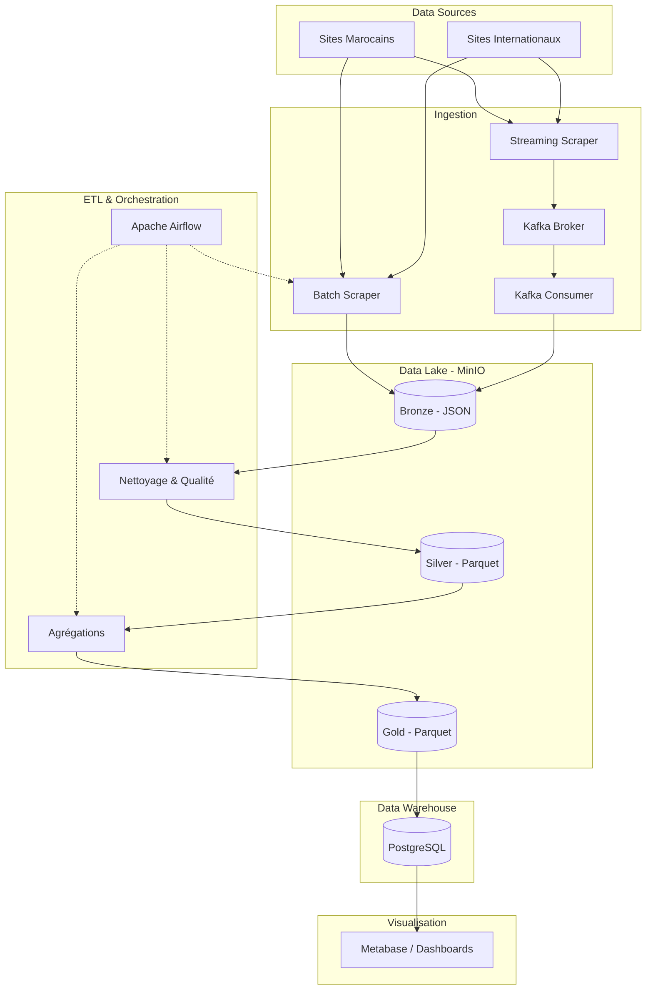

# Plateforme Big Data d'Analyse d'Actualités

## Contexte
Le projet consiste à concevoir et implémenter une plateforme Big Data complète, capable de collecter, stocker, transformer et analyser des articles de presse provenant de sites d'actualités (Hespress, BBC, etc.) afin d'identifier des tendances et d'extraire des indicateurs clés.

## Architecture Détaillée

L'architecture est basée sur des outils Open Source modernes et suit le modèle d'Architecture Médaillon, adaptée aux pipelines Data Lake/Data Warehouse.

### Composants Principaux :

1. **Sources de Données (Scraping)**
   - **Batch Scrapers :** Scripts Python (BeautifulSoup) planifiés via **Apache Airflow** pour s'exécuter à intervalles réguliers (ex: toutes les heures).
   - **Streaming Scrapers :** Scripts Python fonctionnant en continu, écoutant les nouveaux articles (via API ou polling fréquent) et envoyant les événements en temps réel.

2. **Ingestion & Bus de Messages**
   - **Apache Kafka :** Reçoit les articles en streaming sous forme d'événements. Kafka garantit la scalabilité et la résilience de l'ingestion temps-réel.
   - **Kafka Consumer / Spark Streaming :** Lit les événements depuis Kafka et les stocke dans le Data Lake (MinIO).

3. **Data Lake (S3 Compatible)**
   - **MinIO :** Stocke les fichiers de données brutes et traitées de façon distribuée.
   - **Architecture Médaillon :**
     - `bronze` : Raw data. Données brutes au format JSON provenant du Batch et du Streaming.
     - `silver` : Cleansed data. Données nettoyées (sans HTML, texte normalisé, langue détectée) stockées en format Parquet.
     - `gold` : Aggregated data. Données prêtes pour l'analyse, stockées en Parquet, croisées par thème, source, langue.

4. **Transformation & Qualité de Données (ETL / ELT)**
   - Les transformations sont écrites en **Python (Pandas / PySpark)**.
   - Des contrôles de qualité sont intégrés au passage de Bronze à Silver (rejet des articles sans titre, vérification des dates de publication, complétude).
   - Les transformations traitent la suppression HTML, la détection de la langue, et l'analyse de base (extraction de mots-clés).

5. **Orchestration**
   - **Apache Airflow :** Gère la planification (DAGs) et le suivi des pipelines (batch scraping, Bronze -> Silver, Silver -> Gold, Gold -> DWH).

6. **Data Warehouse (Analytique)**
   - **PostgreSQL :** Base de données relationnelle servant de Data Warehouse pour les tables analytiques (Tendances, Articles par Thème/Source, Mots-clés fréquents).

7. **Visualisation (BI)**
   - **Metabase / Superset / Grafana :** Connecté à PostgreSQL. Permet la création de tableaux de bord interactifs pour visualiser les tendances de l'actualité.

8. **Gouvernance & Déploiement**
   - La traçabilité est assurée par des métadonnées (dates d'ingestion, sources, statuts).
   - L'ensemble est conteneurisé. Déploiement local via **Docker Compose**.
   - (Optionnel) Configurations Kubernetes / Helm prévues pour une scalabilité en cluster.

## Schéma des Flux de Données

